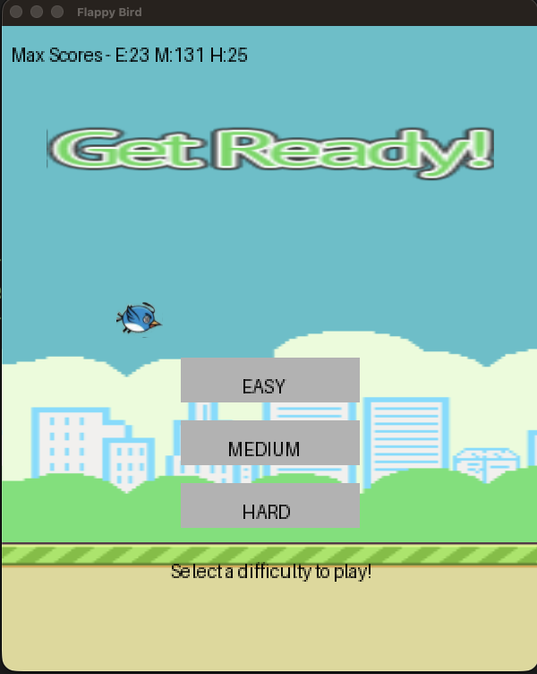
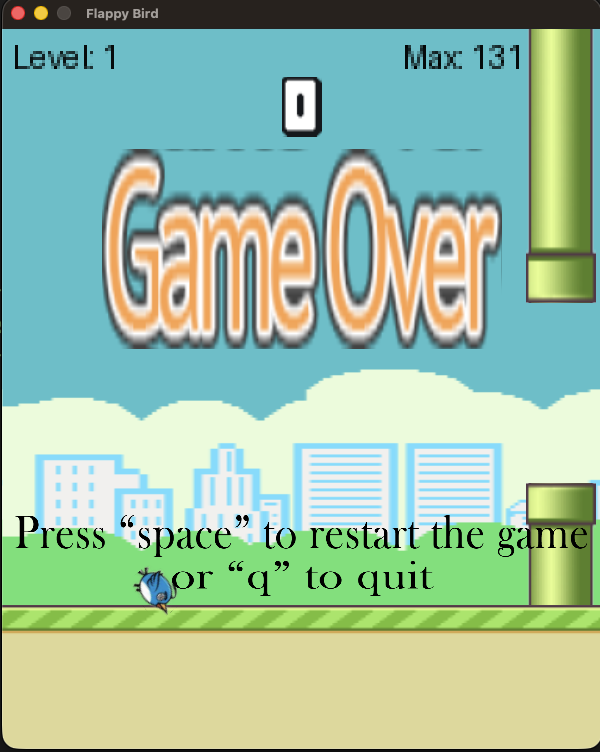

# PyOpenGL Flappy Bird 🐦

A classic Flappy Bird clone built from the ground up using **Python**, **PyOpenGL**, and **Pygame**. This project uses OpenGL for accelerated 2D graphics rendering and features custom physics, dynamic difficulties, and a fully persistent high-score system!

## 🌟 Features

- **PyOpenGL Rendering:** Smooth and performant 2D graphics using OpenGL textures, primitives (`GL_QUADS`), and custom orthographic projections.
- **Difficulty Modes:** Choose between **EASY**, **MEDIUM**, and **HARD**. Each mode dynamically alters gravity, jump velocity, pipe gap sizes, and scrolling speeds.
- **Persistent High Scores:** Your top scores are automatically saved to `high_score.txt` and tracked individually for each difficulty.
- **Custom Physics Engine:** Realistic custom-built gravity and collision detection system scaling perfectly with different game modes.
- **Full Assets Included:** Includes custom bird animations (flapping wings), backgrounds, pipe obstacles, and high-quality `.ogg` sound effects.

---

## 📂 Project Structure

```
PyOpenGL-flappy-bird-main/
│
├── main.py                # Main game loop, rendering logic, and UI (Menu/Game Over states)
├── classes.py             # Game entities: Bird, Pipes, Base (Ground) with Physics & OpenGL Draw methods
├── requirements.txt       # Dependencies needed to run the game
├── high_score.txt         # Persistent JSON storage for highest scores
│
└── assets/                # All game assets!
    ├── audio/             # Sound effects (jump.ogg, point.ogg, die.ogg)
    └── sprites/           # Images (bird animations: up.png, mid.png, down.png, background, pipes, etc.)
```

---

## 🎨 Game Assets

This project utilizes custom 2D textures and sounds which you will find under the `assets/` directory:

### 🖼️ Sprites (`assets/sprites/`)
* **Bird Animations:** `up.png`, `mid.png`, `down.png` (Flapping wing cycles)
* **Background & Ground:** `background-day.png`, `base.png`
* **Obstacles:** `pipe-green.png`
* **UI Elements:** `start.png`, `gameover.png`, `message.png`, `res.png`
* **Score Digits:** `0.png` through `9.png`

### 🎵 Audio (`assets/audio/`)
* **Jump:** `jump.ogg` - Plays every time the bird flaps.
* **Score:** `point.ogg` - Plays when successfully passing a pipe.
* **Crash:** `die.ogg` - Plays upon collision with a pipe or the ground.

### Game Screen


---

## ⚙️ Installation & Setup

1. **Clone or Download** the repository to your local machine.
2. **Navigate** into the project folder:
   ```bash
   cd PyOpenGL-flappy-bird-main
   ```
3. **Set up a Virtual Environment** (Recommended):
   ```bash
   python -m venv .venv
   source .venv/bin/activate  # On macOS/Linux
   # OR
   .venv\Scripts\activate     # On Windows
   ```
4. **Install the Requirements:**
   ```bash
   pip install -r requirements.txt
   ```
   *(Required packages: `PyOpenGL`, `PyOpenGL_accelerate`, `pygame`, `Pillow`, `numpy`)*

---

## 🚀 How to Play

Run the main file from your terminal to start the game:

```bash
python main.py
```

### 🎮 Controls

* **Mouse Click:** Click the buttons on the welcome screen to select your difficulty (EASY, MEDIUM, HARD).
* **Spacebar:** Flap wings / Jump!
* **Q Key:** Quit the game instantly.

Enjoy dodging the pipes and setting new high scores! 🎉
